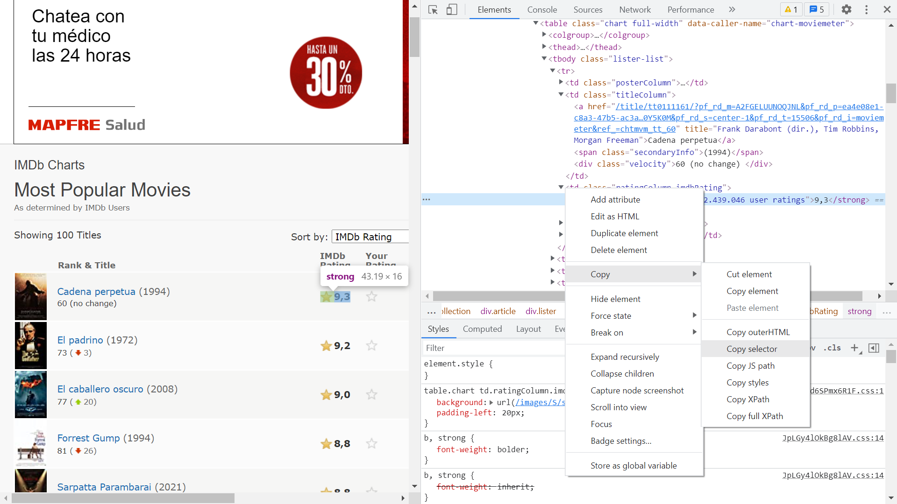

# :zap: Node Puppeteer Webscraper

* Node.js used with [Puppeteer](https://www.npmjs.com/package/puppeteer) & [Cheerio](https://www.npmjs.com/package/cheerio) to gather data from web pages
* PhotosScraper code from [LearnWebCode](https://www.youtube.com/channel/UCHRp19HU7Y2LwfI0Ai6WAGQ) - see [:clap: Inspiration](#clap-inspiration) below. Also includes Imdb film data scraper.
* **Note:** to open web links in a new window use: _ctrl+click on link_


## :page_facing_up: Table of contents

* [:zap: Node Puppeteer Webscraper](#zap-node-puppeteer-webscraper)
  * [:page_facing_up: Table of contents](#page_facing_up-table-of-contents)
  * [:books: General Info](#books-general-info)
  * [:camera: Screenshots](#camera-screenshots)
  * [:signal_strength: Technologies](#signal_strength-technologies)
  * [:floppy_disk: Setup](#floppy_disk-setup)
  * [:computer: Code Examples](#computer-code-examples)
  * [:clipboard: Status & To-Do List](#clipboard-status--to-do-list)
  * [:clap: Inspiration](#clap-inspiration)
  * [:file_folder: License](#file_folder-license)
  * [:envelope: Contact](#envelope-contact)

## :books: General info

* Puppeteer contains a version of Chrome and runs headless by default.
* PhotosScraper.js extracts photos from the LearnWebCode website and stores them.
* Cheerio functions were used in the imdbScraper to access data from the HTML web page
* ImdbScraper.js uses [JS array map method](https://developer.mozilla.org/en-US/docs/Web/JavaScript/Reference/Global_Objects/Array/map) to produce CSV and JSON files with film title, year, rating & url extracted from the HTML

## :camera: Screenshots



## :signal_strength: Technologies

* [Node.js v14](https://nodejs.org/) Javascript runtime using the [Chrome V8 engine](https://v8.dev/)
* [Puppeteer v10](https://www.npmjs.com/package/puppeteer) Node library headless automation tool and API for Chrome and Chromium-based web browsers
* [cheerio v1](https://www.npmjs.com/package/cheerio) to parse markup and provide an API for traversing/manipulating the resulting data structure
* [objects-to-csv v1](https://www.npmjs.com/package/objects-to-csv) to convert an array of JavaScript objects to Comma Separated Variable (CSV) format that is saved as a file.

## :floppy_disk: Setup

* Install dependencies using `npm i`
* `node photosScraper` to run photo data extracting code
* `node imdbScraper` to run film data extracting code
* image and data files are generated

## :wrench: Testing

* N/A

## :computer: Code Examples

* `imdbScraper.js` function to create array of Cheerio objects using map() then return array of elements using get()

```javascript
	const results = $('tr')
		.map((index, element) => {
			// title - convert to text
			const titleElement = $(element).find('.titleColumn > a');
			const title = $(titleElement).text();

			// year - remove unwanted ( and '
			const yearElement = $(element).find('.titleColumn > span');
			const year = yearElement.text().replace('(', '').replace(')', '');

			// imdbRating - convert to text
			const ratingRating = $(element).find('.imdbRating > strong');
			const rating = ratingRating.text();

			// url - take href attribute
			const urlElement = $(element).find('.titleColumn > a');
			const urlAttr = urlElement.attr('href');
			const url = `http://imdb.com${urlAttr}`;

			return title !== '' ? { index, title, year, rating, url } : null;
		})
		.get();
```

## :cool: Features

* Puppeteer can be used to fill in web site data fields. Can be used to extract the latest news/prices etc. from websites which could be made automatic using a server cron job.

## :clipboard: Status, Testing & To-Do List

* Status: Working
* To-Do: Add more Web scraping code - a news site for example

## :clap: Inspiration/General Tools

* [LearnWebCode: Web Scraping with Puppeteer & Node.js: Chrome Automation](https://www.youtube.com/watch?v=lgyszZhAZOI&t=392s)
* [Array.prototype.map()](https://developer.mozilla.org/en-US/docs/Web/JavaScript/Reference/Global_Objects/Array/map)
* [Stack overflow: What does the get() function do in cheerio?](https://stackoverflow.com/questions/54164509/what-does-the-get-function-do-in-cheerio)

## :file_folder: License

* N/A

## :envelope: Contact

* Repo created by [ABateman](https://github.com/AndrewJBateman), email: gomezbateman@yahoo.com
